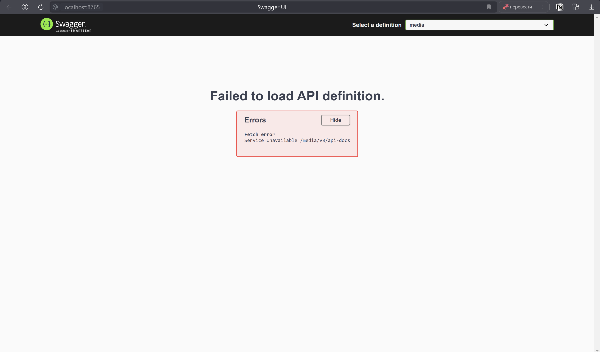

# Сборка проекта на windows
1. Установить Docker если не установлен.
2. Установить Maven если не установлен.
3. Создать у себя на компьютере папку.
4. Открыть эту папку в терминале, щелкнуть правой мыши внутри созданной папки, выбрать открыть в терминале.
5. Ввести команду: git clone https://gitverse.ru/sc/RomanGorkavenko/accounting-for-media.git
6. Затем ввести команды по очереди:
   - cd .\accounting-for-media\
   - mvn clean package
   - docker-compose up
7. Дождаться пока все контейнеры в Docker запустятся, подождать еще немного пока все сервисы пройдут регистрацию.

# Запуск проекта
- Ввести ссылку в адресной строке браузера
   - http://localhost:8765/media-accounting/swagger-ui/index.html
- Если на экране:
   

   - Необходимо еще немного подождать.
   - В итоге вы должны увидеть:

   - Переключение между сервисами в правом верхнем углу экрана.

   - Далее проходим авторизации и получаем токен.

   - Далее копируем токен, выделен на выделен на изображении выше. Нажимаем кнопку Authorize в правом верхнем углу экрана, в появившемся окне вставляем скопированный токен и жмем авторизоваться.

   - Все готово, можно приступать к тестированию приложения.
   - Авторизацию с помощью токена, необходимо проходить в каждом сервисе отдельно.
   - Ссылки на API docs:
     - Media Service URL
       - http://localhost:8765/media/v3/api-docs
     - User Service URL
       - http://localhost:8765/user/v3/api-docs
     - Eureka
       - http://localhost:8761/

